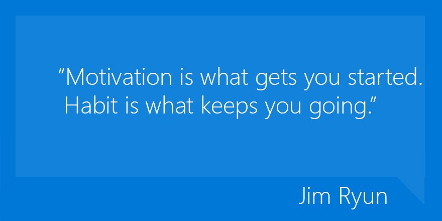
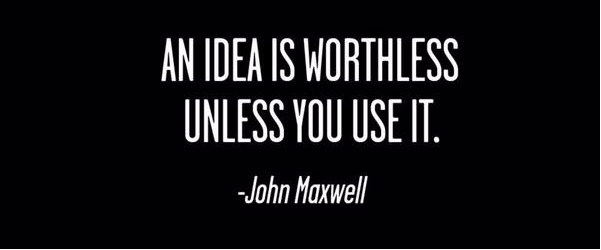
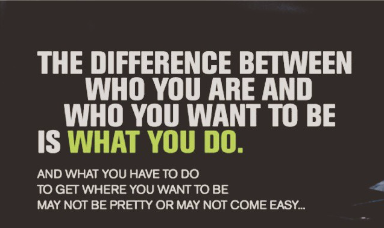
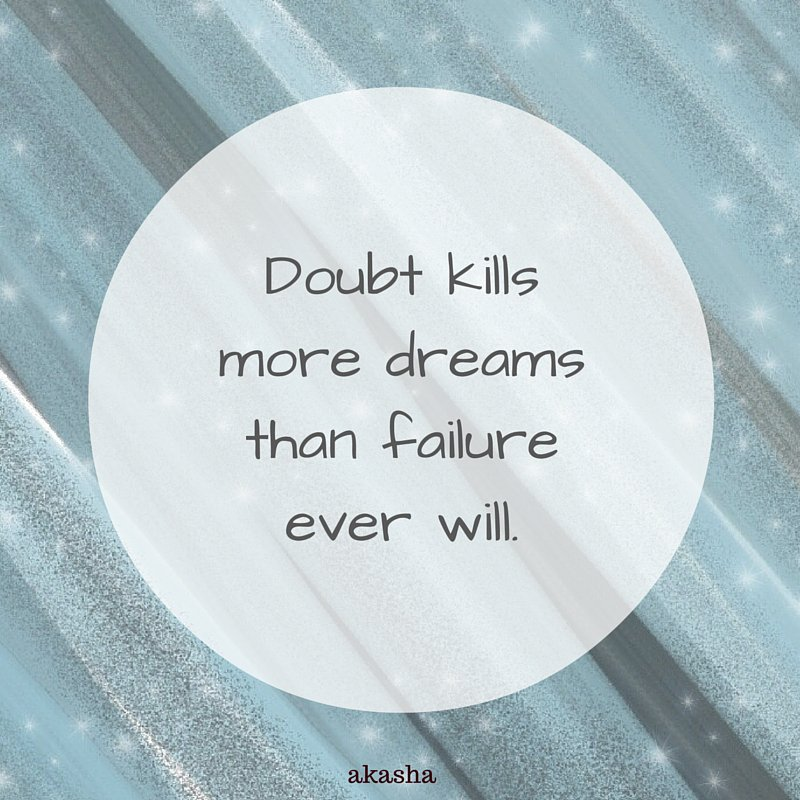

Quotes 
====

An idea is worthless unless you use it. -John Maxwell

You must see yourself in a greater place than you are right now in order to reach your optimal level of success. You must also be willing to take a leap of faith into your desired destination and away from the crown of procrastination, complacency, and mediocrity. IT'S TIME TO EXPERIENCE THE ABUNDANT LIFE!!!!

No excuses ! You want something in life you have to work for it
 

### "I may not be there yet but am closer than i was yesterday" ~José N. Harris  

